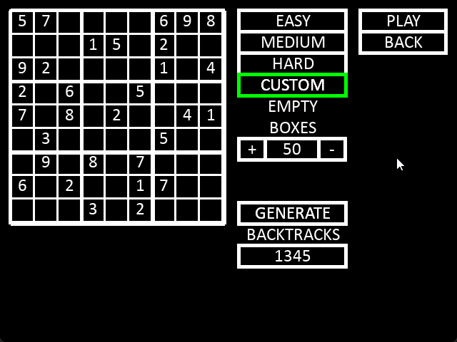
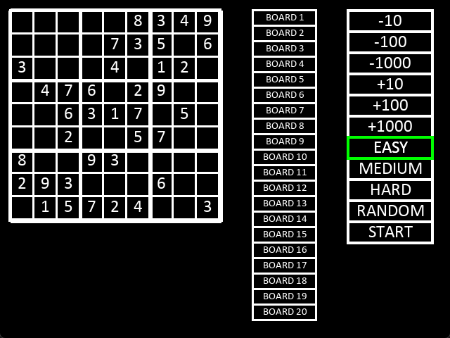
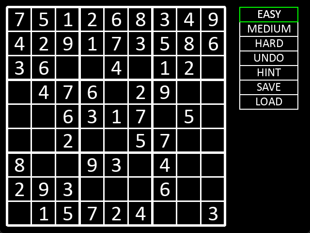

# Sudoku Game

A graphical Sudoku game implementation written in C using the Allegro 5 library.
This project was written for **Podstawy programowania 2** at **Kielce University of Technology**.



|           Main Menu           |          In-Game View          |
| :---------------------------: | :----------------------------: |
|  |  |

## Features

- **Procedural Generation:** Unique puzzles generated on the fly.
- **Graphical Interface:** Custom UI built with Allegro 5 primitives.
- **Save System:** Binary serialization allows saving and loading game state.
- **Game Logic:** Real-time validation and puzzle management.
- **Menu System:** Interactive main menu and pause screens.

## Tech Stack

- **Language:** C (C99)
- **Build System:** CMake
- **Dependencies:**
  - **Allegro 5:** Graphics, Input, System, Audio, Fonts

## Controls

| Key / Input     | Action               |
| :-------------- | :------------------- |
| **Mouse Left**  | Select Cell / Button |
| **Numbers 1-9** | Fill Cell            |
| **Backspace**   | Clear Cell           |
| **ESC**         | Open Menu / Pause    |

## 🚀 Build & Run

### Prerequisites

- **CMake** 3.11+
- **C Compiler** (MSVC recommended)
- **vcpkg** (Environment variable `VCPKG_ROOT` must be set)

```bash
# Configure
cmake --preset x64-release

# Build
cmake --build --preset x64-release

# Run
./out/build/x64-release/Release/Sudoku.exe
```
